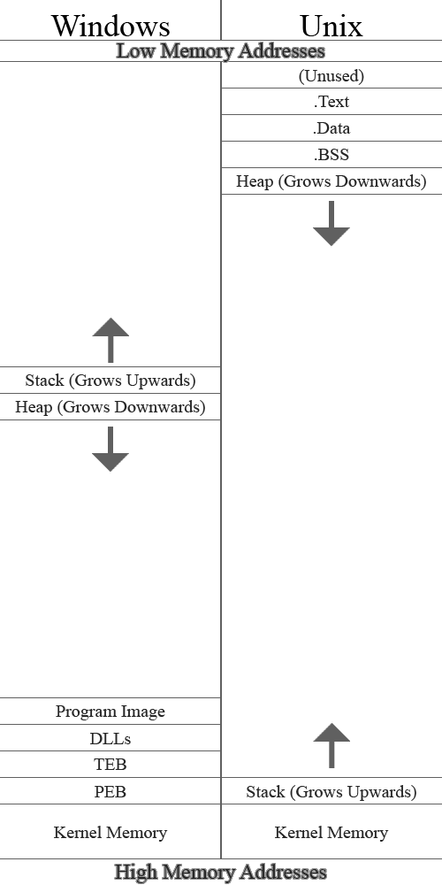

# Memory Allocation


Have you ever thought about *how you think*? It might be fair to say that computers have no choice, and that includes
how they "remember things". In this post I'll be talking about how memory allocators work.

A memory allocator simply put is the portion of code that almost every program uses to *dynamically* create sections of
memory for information to live. But before we get into that, I think it's important to talk about the other major place
memory lives during the lifetime of your program, *the stack*.

Aside: although these concepts are almost universally applicable, I will be discussing this post from a C/++-esq
perspective.

## The stack

When your program begins running instructions one-by-one, starting from `main()`, eventually your program will
encounter a function, which is (for the intents and purposes of this discussion):

- a group of instructions
- that perform a conceptual task
- that you've given a name
- and something you may wish to do multiple times during your program

Whenever you call this function, your program begins executing that segment of your code. Notably though, when this
function is through it resumes from the location where it was called from, and all "contextual information" from the
caller is as you left it. Although this seems natural, our computers make sure that everything stays in order very
intentionally, and goes out of its way to do it.

Consider a `main()` function that has a couple of variables at the beginning, followed by a function call:

```c
void main() {
    int x = 5, y = 10;
    //some stuff...
    foo();
    //more stuff...
}
```

Now, imagine that it's *you* doing this work, [not a computer]. First you have two variables `x` and `y`. As a busy
human with a fried short-term memory, not only is it important you keep track of where you decide to record the
variable values, but it's important you record the information necessary to disambiguate `x` from `y`, and whatever
other variables you might have. In a computer, the names themselves aren't very important, but you do need to remember
that any particular variable (e.g., `x`) corresponds to a specific memory address. You can call it whatever you want,
but since a memory address is simply a number, we might just refer to `x` by the address where it sits in memory. This
distinction is important, as we'll see later.

Now realize that once you call `foo()`, you now have a whole extra sequence of instructions to complete. `foo()` may
even contain other function calls, which contain more variables and more function calls. It's a mess! Organization is
the key, and the way a computer approaches this issue is could be similar to how you might keep track of it.

Let's say at the beginning of `main()`, you took out your dry-erase marker and got busy. At the bottom of your
whiteboard you labeled "main" (denoting that everything above "main" pertains to the stack frame of main[^1], unless
superceeded by another label). Then, above "main" you wrote the labels `x` and `y` (bottom to top[^2]) in black marker.
Then, upon the first assignment to `x` and `y`, you write their values to the right of `x` and `y` in blue marker[^3].
As you perform `//some stuff...`, possibly utilizing and/or manipulating the values in these variables, it's now time
to execute `foo()`. Since you've recorded the variables and their values on the whiteboard, we fortunately don't have
to rely on your poor short-term memory[^4].

At this point, your whiteboard looks something like this:
```
y 10
x 5
main
```

As we begin executing `foo()` we write the label "foo" to denote the beginning of a new stack frame. From this point
on, we can ignore the portion of the stack corresponding to "main", and we can just focus on "foo". If `foo()` ends up
calling another function(s), we can simply repeat this process. This may lead to a rather tall column of text on your
whiteboard, but we don't need to worry. Every time we finish working on a function, we need to return to the place that
this function was called from to continue working on the program (in this case, we would return to `main()`). Notably,
the purpose of `foo()` was to fulfill a task, and now that we're done, any text on the whiteboard corresponding to this
call to `foo()` (i.e., its stack frame) can be erased, since we're done with it.

Note that any creation of data (compiler optimizations aside[^5]) results of stuff getting put on the stack. Here's an
expanded example of `main()` above, each significant line of code has an accompanying comment that shows the state of
the stack at that point, as well as a number denoting the order of execution.

```c
void foo() {
    /*
    execution step #3

    foo
    y 10
    x 5
    main
    */
    int z = 20;
    /*
    execution step #4

    z 20
    foo
    y 10
    x 5
    main
    */
    //some stuff...
}

void main() {
    /*
    execution step #1

    main
    */
    int x = 5, y = 10;
    /*
    execution step #2
    y 10
    x 5
    main
    */

    //some stuff...
    foo();
    /*
    execution step #5
    
    y 10
    x 5
    main
    */
    //more stuff...
}
```

Critically, not only can functions "perform tasks", but they can "perform tasks, and report back some information".
After all, if it were you performing this work, it would be resonable if executing a function
sucessfully/unsuccessfully/[something else] might affect what you choose to do next. Computers do have a simple
mechanism for returning small values[^6], and even large values could be returned on the stack. I.e., as the executor
of a function, you could simply decide that upon finishing a function, instead of erasing *everything* on the
whiteboard pertaining to the stack frame of that function, you could keep the information regarding the "result" of
that function, and "adopt"[^7] it into the stack of the calling function. Although it may be natural to allocate space on
the whiteboard for variables in the order they appear in the function source code, the only important part is that the
code that interacts with these variables "remembers where they live" i.e., it doesn't really matter where on the stack,
so long as it's in the stack frame. With this in mind, we can be sure to allocate the memory where the return value
lives at the very beginning of the function call, so that the caller of the function can easily "adopt" the return
value into it's stack frame without also including all the other junk in the former stack frame.

Consider this simple example:

```c
int foo() {
    int z = 5;
    return z;
}

void main() {
    int x = 5, y = 10;
    int foo_result = foo();
}
```

At the very end of main, the stack frame may look something like this:
```
foo_result 5
foo (ignored)
y 10
x 5
main
```

Notably, the value `z` from foo would have sat above the foo label, and then upon arriving back at `main()`, the value
`z` that got adopted into `main()`'s stack frame was given a new name `foo_result`. However, the label `foo` for the
former stack frame for the call to `foo()` is still on the stack, but we can just ignore it. As amazing and efficient
as this process seems to be, it isn't perfect. Consider this example:

```c
int bar() {
    int z = 5;
    return z;
}

int foo() {
    int bar_result = bar();
    //some other large stack frame data...
    return bar_result;
}

void main() {
    int x = 5, y = 10;
    int foo_result = foo();
}
```

Walking through a similar thought process, at the very end of main, the stack frame may look something like this:
```
foo_result 5 //formerly bar_result, formerly z
bar (ignored)
//some other large stack frame data...
foo (ignored)
y 10
x 5
main
```

Assuming the same procedure of "adopting" `z` into `foo()`'s stack frame when calling `bar()`, and again with adopting
`bar_result` into `main()` as `foo_result`. Since `foo()` had `//some other large stack frame data...`, this leads to a
messy and bloated stack frame for `main()`. Although in this example it's ok, what if `main()` had more stuff at the
end (e.g., another function call). Since `foo_result` is adopted into `main()`'s stack frame, our stack grows from the
location of `foo_result`, not `y`. It isn't hard to imagine that complex programs could coincedentally "game the system"
to cause the majority of stack space to consist of useless bloat, which isn't ideal. We want our memory to be
efficiently used, not wasted! These considerations get *especially* messy when you realize that the context in which
other functions might be called could be *different*. E.g., what if `main()` calls `foo()`? Well, we need to handle
the stack in a certain way. What if `main()` calls `bar()` directly, or what if `bar()` calls `foo()`, which calls
`bar()` recursively? Although it *is* possible to keep track of when/how things need to be moved around to prevent
data from getting squashed, **this sucks**.

What if instead of "adopting" the variable into `main()`'s stack frame, we just let it exist out there in no-mans land.
This means we can let the stack grow from `y`, and all we need to do is make sure that if the stack grows large enough
to overlap `foo_result`, we need to relocate `foo_result` somehow. We could make sure to grow from 
`y + sizeof(foo_result)`, and simply relocate `foo_result` to that saved location if we ever grow large enough. Maybe
we could relocate it *really really far forward* in the stack. If we do this though, we would need to make sure that
any other situations where we similarly relocated adopted variables "*really really far forward*" in the stack don't
accidentally end up in the same spot. However, a copy is a copy, and copying it really far forward might not be enough.
We may have to copy it forward several times, so maybe we should just copy it adjacent to `y` to begin with to avoid
the possibility of needing to copy it multiple times.

Although a nonstandard compiler extension[^8], what if the size of a variable on the stack isn't known at compile time?
e.g., what if the "size of the variable" is dependent upon user input? Consider something *like* this:
```c
void main(int argc, char* argv[]) {
    //safety concerns aside...
    int size = atoi(argv[1]);
    char buffer[size];
}
```

Well, if/when we have a subsequent function call, deciding where to put the label for that function call to begin a new
stack frame requires *checking* and *adding together* the lengths of these variably sized stack variables[^9]. Also,
it sucks that we have to even keep track of the size of these variables for these calculations on the stack, because
that data might not be something the programmer cares about. If these arrays were known in compile time, we could just
make sure that all the assembly that gets generated does so in a way that's certain about the size of this variable,
thus relieving us of this extra work (which is the default behavior). If you wonder why classic C code often has
compile-time buffer sizes, this is one reason why.

This is starting to feel nasty, but it's the brand of nasty that compiler developers deal with, and it might be fair to
say that a limited amount of nasty is fair in *practice*. If you squint your eyes, what I've described is essentially
just a stack machine[^10]. Unfortunately, we live in a real, physical, world (yuck). We need to obey the laws of
physics[^11], and these are implementation details after all. We've designed our computers with the goal of *doing
work*, and we try to limit the amount of *work we need to do to be able to do our work* to a minimum. Given that we're
talking about memory, things like computer cache/TLB/registers/virtual memory all come to mind and are consequential
in this situation, although some of this was ""arbitrarily"" designed, e.g., cache was invented because SRAM is
expensive and not dense compared to DRAM (but we wanted capacity). Virtual memory was invented so the OS could handle
process relocation (rather than it being done statically in the program, or the program needing to patch itself). TLB
was invented due to the inventions of both cache and virtual memory.

There's a lot of things our computers *could do* to be faster, whether it be nasty dynamic stack shenanagains, or
unpatching various side-channel attacks against our predictive computation systems, but there are reasons not to[^12].
Although it's unfortunate that the stack isn't perfect for everything we'd like to do with it, you should be
grateful[^13]!

So what other ideas do we have to solve this problem of *dynamic memory allocation*?

## Dynamic memory allocation

Golly, **what a headache**. It seems to me that separating the portion of memory that seems to be good for keeping
track of control (execution) from the *data* data is a good idea. Lets take a simplified look at how memory is laid
out for a typical process.

<picture>
  <!-- User prefers light mode: -->
  <source srcset="ProcessLayoutWinUnixLight.png" media="(prefers-color-scheme: light)"/>

  <!-- User prefers dark mode: -->
  <source srcset="ProcessLayoutWinUnixDark.png"  media="(prefers-color-scheme: dark)"/>

  <!-- User has no color preference: -->
  
</picture>


There's a few notable things about the layouts of unix/windows processes:

- In windows, the stack grows towards low memory addresses. Note that this means that the (virtual) memory address 0 is
the absolute limit for the stack size.
- In unix, the stack grows towards the heap. This means the "absolulte largest size the stack can be" is a bit less
obvious. It depends on the size of the heap.
- In both, similar implicit limits exist for the "Heap".
- In windows, "Program Image" roughly equates to ".Text" + ".Data" + ".BSS" in unix.
- "Kernel Memory" in both refers to the memory that the operating system occupies. The kernel memory is in a processes
virtual memory map for syscalls[^14].

And guess what? There *is* (essentially) a "second stack" that we can use for our *data* data, it's the heap!

To interact with the heap, on unix there's `s/brk()`, which increases/decreases the size of the heap. `s/brk()` usage
is often discouraged because it isn't thread safe, and because the "default" C memory allocator `malloc()` uses
`s/brk()`, so any additional usage of it will mess up `malloc()`[^15]. If we intend to use `s/brk()` for our memory
allocator, we either need to not include the standard C library (which may be an issue if any libraries we use require
the library), or we need to make sure our dynamic memory allocator has the *exact* same API as the standard
implementation, and link against our implementation instead.

On windows, `HeapAlloc()`, `LocalAlloc()` and `GlobalAlloc()`[^16] all interact with the heap, but do so in different
ways. `malloc()` usually wraps `HeapAlloc()` on windows, and although the problems with `s/brk()` above don't apply due to the presense of actual management with these three functions, I would rather that a cross platform implementation of *my*
memory allocator use logically similar sources of memory. Although these functions internally manipulate the heap
directly, there isn't an API method to "`s/brk()`" on windows directly.

`malloc()` is smart in that it makes large increments in `s/brk()` on unix & simply wraps `HeapAlloc()` on windows,
this prevents heap thrashing[^17] and reduces the number of necessary syscalls. `malloc()` is implementation defined
though, so you can't always rely on it working this way. Fortunately, the implementers are smart and attempt to back
`malloc()` with the best solution for the platform.

POSIX[^18] specifies `mmap()`, which allocates more memory pages that exist outside of the Process Memory layout
diagram above[^19], fetched straight from the kernel's free pages. `mmap()` has some additional features, namely the
ability to share the memory mapped in this fashion with other processes, allowing these processes the ability to
communicate with each other as they run.

On windows, `VirtualAlloc()` is very similar to `mmap()` in that it fetches more pages from the kernel. It can even
lazily allocate memory[^20], and share it with other processes. Note that page*s* requested in either of these fasions
are guaranteed to be consecutive within single calls, but subsequent calls may not be adjacent to pages from a previous
call. This is more likely to be the case if you have other things in your process calling `VirtualAlloc()`/`mmap()`.
Additionally, both of these functions have additional features, and I encourage you to do your own reading about these
systems.

### Implementation

With either of these functions, for every dynamic value you wish to store, nothing's really stopping you from using the
page(s) for your single variable, but since mnay values are far less than 4KiB or (page size), this would be very
wasteful. With this in mind, we know that we'll need to have some internal management mechanism.

My goal was to make a memory allocator that was compatible on both windows and linux and wouldn't interfere with
`malloc()`, so first I wrote cross-platform methods to allocate and free page(s).

```c
void* p_alloc(size_t pageCount)
{
	void* result;
	size_t byteCount = pageCount * p_size();
#if _WIN32
	result = VirtualAlloc(NULL, byteCount, MEM_COMMIT, PAGE_READWRITE);
	if (result == NULL)
	{
		fprintf(stderr, "Windows Virtual Alloc Failed: %d", GetLastError());
		exit(-1);
	}
#else
	result = mmap(0, byteCount, PROT_READ | PROT_WRITE, MAP_PRIVATE | MAP_ANON, -1, 0);
	if (result == MAP_FAILED)
	{
		fprintf(stderr, "POSIX mmap failed: %d", errno);
		exit(-1);
	}
#endif
	return result;
}
```

This page allocation function allocates for you `pageCount` pages in a platform agnostic way. We make sure to set
appropriate settings (e.g., we do not want to enable the ability for this memory to be executable). I leave `p_free()`
as an excersize to the reader.

You'll notice that we allocate memory in terms of `pageCount`, which isn't that useful alone. Since we're ultimately
working with requests in terms of `bytes`, we need a way to know how large a page is on the given platform. Here's how
I did that.

```c
size_t p_size()
{
	static size_t ps = 0;
#if _WIN32
	if (ps == 0)
	{
		SYSTEM_INFO si;
		GetSystemInfo(&si);
		ps = si.dwPageSize;
	}
#else
	if (ps == 0)
		ps = getpagesize();
#endif
	return ps;
}
```

Since batching calls (e.g., the way `malloc()` does it) can reduce syscalls, we want to ensure that the several places
throughout our code where we have to check the size of the pages (so we can calculate the number of bytes we have), is
fast, and doesn't have too many system calls. Even with the fanciest of operating systems (to my knowledge), changing
the size of pages on your system would require a system reboot. Thus, we only need to check the page size once (via a
syscall), and we cache it in a static local and return that cached value for all subsequent calls.

I'd like to get onto the algorithm itself now, but there's an important thing to note. Since we're *writing* a memory
allocator, that means we can't *use* a/the memory allocator (since it *isn't written yet*). That means whatever data
structures we decide to use need to be simple, in-place, and need to function with "raw memory". Given that we're
allocating chunk(s) of pages.

Since one of our goals is to divvy up these large page(s) into small pieces of memory, lets define a "node". Let's say
this node's responsibility is denoting a "small memory piece", and it has the necessary information to observe adjacent
nodes too.

```c
struct HeapNodeHeader
{
	HeapNodeHeader();
	HeapNodeHeader(unsigned long long size, bool isCurrentFree);
	unsigned long long header_data; //stores info like the "size" of this node
	//Do not derefence, instead "return &mem".
	void* mem; //this member sits at the location of the user's memory.

	bool isImmediatePreviousFree();
	bool isCurrentFree();
	bool isImmediateNextFree();

	unsigned long long size();
	void setCurrentFree(bool isFree);
	void setSize(unsigned long long size);

	HeapNodeHeader* immediatePrevNeighbor();
	HeapNodeHeader* immediateNextNeighbor();
};
```

Good. However, lets say that we have a ptr to a `HeapNodeHeader` from one of our pages. How do we find its left/right
neighbors? We know that these nodes "sit next to each other", but given that these nodes are different sizes (since the
user requests memory of different sizes), this might cause a problem. We imagine that the *next* neighbor sits at 
`this + sizeof(HeapNodeHeader) + size()`, but what about the previous neighbor? To know where it sits, we would need
to know how large it is in order to calculate how far back it is (classic chicken or the egg type problem).

To fix this, let's introduce another data structure.

```c
struct HeapNodeFooter
{
	HeapNodeHeader* header;
};
```

What we'll do, is whenever we allocate memory, (via our `malloc()` equivalent), we'll make sure to account for the size
of both `HeapNodeHeader` and `HeapNodeFooter`. We'll put the `HeapNodeFooter` at the very end of a node. This means, all
we need to do to get our *previous* neighbor is `((HeapNodeFooter*)(this - sizeof(HeapNodeFooter)))->header`. Easy!
Modify your `HeapNodeHeader` definitions/implementations appropriately.

At this point, with several nodes, memory would probably look something like this:

```
=======================================================================================================================
| HNH | (user memory) | HNF | HNH | (more user memory) | HNF | HNH | (more user memory) | HNF | HNH | (more user mem...
=======================================================================================================================
```

At the beginning of our program (perhaps in our heap constructor), lets simply allocate a single page, put a HNH/HNF in
it and mark it as free.

On a side note, many operating systems enjoy or even require "aligned access" for performance and other reasons. Namely
we should make sure that every "(user memory)" address sits on a 16-byte aligned address. All this means is that as we
create HNH/HNF, we should do it in a way where the location of the user memory looks something like `0xABCD0000` (i.e.,
the address ends in four zeroes, indicating it's evenly divisible by 16). Since the memory page itself is 16-byte
aligned, but we have a leading HNH before the actual user memory, we need to do things like:

- Artificially introduce padding before the first HNH in a set of page(s) to ensure that
`sizeof(padding) + sizeof(HeapNodeHeader)` is 16-aligned so that "(user memory)" is *also* 16-aligned
- Artifically increase the requested size of our `malloc()` call so that the
`sizeof(user memory) + sizeof(HeapNodeFooter)` will allow the following HNH to also be properly placed, so that *its*
"(user memory)" is also 16-byte aligned.

In the current implementation, `sizeof(HeapNodeHeader) == 16` (but that includes the size of `mem`, and for intents and
purposes, `mem` is the *body* of the node, which we don't want to include). So lets say the size of the header is 8,
and `sizeof(HeapNodeFooter) == 8`. Assuming 4KiB, this means the page at the beginning will be something like:

```
=======================================================================================================================
| 8 bytes of padding | HNH |              (giant body comprising almost the whole page)               | HNF | padding |
=======================================================================================================================
```

To keep our algorithms simple, the padding at the end of the page exists because we placed the HNF in a way where a HNH
could be validly placed after it (with correct alignment etc), even though it's the end of a page and there won't ever
be a HNH there.

Since we artifically inflate the size of nodes to ensure their alignment, this also means that the size of any node
will be (a multiple of 16) + 8. This means that the size (in binary) will always have three zeroes in the bottom bits.
Awesome! We can use this extra space for three bitflags. We could use all three bits to store flags, but let's just
store a bitflag indicating if *this* node is free. If we ever need to check if a neighbor is free, we just access it
through the footer or size calculation like formerly outlined.

Let's discuss our first allocation. When our `malloc()` is called for the first time, we do have this giant free node.
We can set the free flag to false, and return `&mem`, but chances are the requested memory size isn't nearly as large
as the node is in its current state. If we did this, well, we wouldn't be any less better off than just returning the
entire page for the `malloc()` instead. To make this better, let's cut up the node into two pieces, and give the 
properly sized node to the caller.

```c
//make sure it's larger than the mandatory size
size = (size < sizeof(HeapNodeHeader::HeapNodeMandatoryBody)) ? sizeof(HeapNodeHeader::HeapNodeMandatoryBody) : size;
size = (size % 16 != 0) ? size + (16 - (size % 16)) : size; //make sure it's a multiple of 16

//if node is large enough to be split into two pieces:

HeapNodeFooter *ff = candidate->myFooter();
size_t oldBigSize = candidate->size();
candidate->setSize(size);
candidate->setCurrentFree(false);
candidate->myFooter()->header = candidate; //by setting size first, myFooter() points to the location of the new footer
ff->header = candidate->immediateNextNeighbor(); //by setting the footer, this points to the location of the new HNH
HeapNodeHeader* nf = ff->header;
nf->setCurrentFree(true);
nf->setSize(
	oldBigSize - 
	(sizeof(HeapNodeHeader) + 
	sizeof(HeapNodeFooter) + 
	size - 
	sizeof(HeapNodeHeader::HeapNodeMandatoryBody));
```

The above code splits it up into two pieces, and returns the left half for `malloc()`, the right half is the remaining
free bit. Note that in the circumstance that the requested size is "pretty large" we need to make sure that there's
room for a HNH/HNF combo to be interjected in the "body" of the node in this fashion. If we were to do this, and the
"free bit"'s size was smaller than the minimum size for a node (i.e., 16 bytes in our implementation), then there's
no point splitting it up, and we may as well just use the whole node for the `malloc()`, even if it's a tiny bit
oversized. This is fine for our big-O, because this size overhead for these nodes is O(1).

Now that we've split up this node, we could imagine the page looks something like:

```
=======================================================================================================================
| 8 bytes of padding | HNH | (user memory) | HNF | HNH |                (free memory)                 | HNF | padding |
=======================================================================================================================
```

Now lets say that the user calls our `free()`, the memory looks something like:

```
=======================================================================================================================
| 8 bytes of padding | HNH | (free memory) | HNF | HNH |                (free memory)                 | HNF | padding |
=======================================================================================================================
```

Now I ask a question: what if the user calls `malloc(approximately sizeof(HNH+HNF+both free memory))`? Conceptually,
we *do* have enough room in this page for their request, however, what we *have* is two separate nodes, neither of
which can fit the requested size. What we *could* do, is undo the "splitting" of the free memory into two nodes, and
combine them back into a single node. This of course only works if the nodes (2+) that we want to merge together are
all *free* nodes (we don't want to mess with the user's active memory). It would be annoying to start at the beginning
of the page and walk through all the nodes via `immediateNextNeighbor()` to check for nodes that we could coalesce
into single nodes, so instead, lets be smart and check for the possibility of coalescing nodes together *whenever a
node gets freed*.

Whenever a node gets freed, there are four circumstances to consider:
- it's previous neighbor is free, but it's next neighbor isn't
- it's previous neighbor isn't free, but it's next is
- neither neighbor is free
- both neighbors are free

It's easy to imagine what to do in each of these four circumstances. I'll show what I did for the first case, but I'll
leave the next as an excersize to the reader.

```c
//if prev is free, next is not free:

//no need to mark prev as free (already free)
currentNode->myFooter()->header = prevNode; //make current footer point to new head (prev)
prevNode->setSize(
	prevNode->size() + 
	currentNode->size() + 
	(sizeof(HeapNodeHeader) - 
	sizeof(HeapNodeHeader::HeapNodeMandatoryBody) + 
	sizeof(HeapNodeFooter))); //update size
//prevNode's old footer, and this node's current footer have both been abandoned by this point, no *need* for cleanup
```

By ensuring this occurs every time we free a node, we've created an invariant in our data structure[^21]. By making
sure that our avaliable free nodes are always maximally sized, this help us waste less memory by not making unecessary
requests for more pages.

The one thing that could make this better, would be if we could occasionally copy/paste all the free nodes to one end
of the page (and coalesce them together), and all the used nodes to the other end of the page. Unfortunately, this
doesn't work because the pointers we passed via our `malloc()` would no longer point to correct locations. We could
accomplish this by doubly-indirecting access to the backing user memory. I.e., our `malloc()` returns a `void**`. The
user would dereference twice to access their memory, and they could safely copy this pointer to share around their
code. However, we could maintain access to the middle pointer, defragment the heap (i.e., the aforementioned
copy/paste and movement of the data, and then update the middle pointer to properly point to the new location).
We would only need to make sure that the inital pointer that points to the middle pointer never changes. In fact,
this feature of "heap defragmentation" is something that garbage collected memory management[^22] uses all the time.

If you wish to implement a heap in this fashion, go for it! However, you'll be suprised how effective node coalescing
alone can improve performance, which is what I went with for simplicity.

We've done well so far, but we still have a looming issue. At the very beginning, we allocated a single page for our
purposes. What if that isn't enough? Well, we could allocate more pages, but we still have our original pages with
memory that's being used by the user still, and we're about to add a new one that's going to be utilized too. Since
we have two blocks of pages, we need to manage them both. Sounds to me like we're going to need a dynamic memory
structure...

Don't think too hard! Remember the padding we had at the beginning of the pages? What if we use that space to form a
linked list between our pages? While we're at it, so long as we expand this padding by a multiple of 16, we can
maintain our important alignment scheme. Here's the data structure I put at the beginning of my page blocks:

```c
struct PageHeader
{
	PageHeader *prev, *next; //linked list of pages.
	HeapNodeHeader *efl_head, *efl_tail; //*ignore me for now*
	unsigned long long sizeBytes; //the size of these page(s) in bytes, always a multiple of the OS's p_size()
	HeapNodeHeader* immediateFirstNode(); //very first element in this page(s) block
	HeapNodeHeader* immediateLastNode(); //very last element in this page(s) block
	bool isEntirePageFree(); //do these page(s) consist of a single free HeapNode?
};
```

Front and center, we store a doubly linked list connecting all of our pages together. Now we can manage multiple pages.
Keeping track of them is important, because if a page becomes fully free (and if we have several of them), it would be
good to free some of them back to the kernel, so it can be used for other processes if necessary. This wasn't obviously
necessary since all of our `free()` operations would simply take the passed ptr and subtract `sizeof(HeapNodeHeader)`
to access its HNH.

Our dynamic memory allocator now works! Is there anything else we can do to make it more efficient?

There are several options, but one of the most popular ones is an Explicit Free List implementation. Currently, the
list of all free nodes that we'd like to consider for `malloc()` is implicit, i.e., we start at the head of the page
and walk forward until we find a node that can fit our user's request (split it up into two pieces if we can). We can
do better. In our page header, we have two pointers, `efl_head` & `efl_tail` that store pointers to HNH's of both the
largest free, and smallest free node in this page block. Initially, with a single free node, both of these pointers
point to the single giant free node in the page. As the memory allocator gets used, and the page block gets peppered
with both utilized and free nodes, we can use a convenient trick.

Remember how we enforced a minimum node size? Besides the fact that it would be silly to have a free node with `0`
size due to the overhead of HNH/HNF, our minimum size due to padding of `16` bytes was coincedentally convenient.
Pointers 64 bit platforms are 8 bytes, and for free nodes (i.e., the nodes whose body *aren't being used by the
user*) we can use their body to store a doubly linked list, that connect all of the free nodes together. This means we
can look through *just* the free nodes when we're looking for a node for a `malloc()` request. Here's an updated form
of HNH:

```c
struct HeapNodeHeader
{
	HeapNodeHeader();
	HeapNodeHeader(unsigned long long size, bool isCurrentFree);
	unsigned long long header_data; //stores info like the "size" and "is this node free"
	union HeapNodeMandatoryBody
	{
		void* mem;
		struct
		{
			//"prev" goes larger, "next" goes smaller
			HeapNodeHeader *prev, *next;
		} efl; //explicit free list
	} content;
	bool isImmediatePreviousFree();
	bool isCurrentFree();
	bool isImmediateNextFree();

	unsigned long long size();
	void setCurrentFree(bool isFree);
	void setSize(unsigned long long size);

	HeapNodeHeader* immediatePrevNeighbor();
	HeapNodeFooter* myFooter();
	HeapNodeHeader* immediateNextNeighbor();
};
```

The user memory pointer, and the explicit free list are in a union together, which saves us space. (After all, we only
use the EFL if the node is free, so the user isn't using the memory). At this point, whenever we `malloc()` something,
it's trivial to remove this node from the EFL & stitch the broken ends back together (make sure the update the PH if
it turns out that this change would change the head or tail of the EFL). However, if we're freeing a node, all we have
access to (via `ptr - sizeof(HeapNodeHeader)`) is the node's header. If we want to add it to the EFL, we need to find
another free node in order to walk through the EFL and stitch it into place. However, our invariant guarantees nothing
about how often a free node occurs. If we have an *extremely large* page block, and as we walk through our
previous/next neighbors, it may be a long time before we finally find a free node to stitch it into the EFL. By keeping
track of a doubly linked list of all the pages, we can check if our node lies within the memory range of each of the
pages (i.e., `ptr > page_header && ptr < page_header + page_header.sizeBytes`), and if so, we can stitch it in via
accessing the EFL via the pointers stored in the page header.

There's lots of other optimizations we can do (some are mutually exclusive)!
- ensure that the page headers in the doubly linked list are stored in memory address order, perhaps even implement a
skip list[^23] to accelerate the search for the correct page header when freeing memory.
- ensure that the page headers in the doubly linked list are stored in order of their largest or smallest EFL member,
allowing for a system where searching for a page with a large enough free node is only *just* large enough to fit it,
saving the larger nodes for other allocations.
- ensure that all the elements in the EFL are sorted smallest to biggest, so that every time you need to `malloc()`,
you can check if the largest EFL element in a page block is large enough to fit the request. If not, you know there's
nothing bigger in the EFL of that page, so you can skip checking it all! Additionally, if your requested size is larger
than the smallest node in the EFL (but not by very much), you can start at the small end of the EFL and walk in the
largerward direction until you find the first EFL element that's *just barely* big enough to hold your request, thus
saving on memory. Similar logic can be applied if the requested size is only slightly smaller than the largest element
in the EFL.
- If nodes in the EFL are large enough to support the size (i.e., increase the mandatory size of a heap node to store
this information on a per-node basis), you can optionally implement a skip list throughout nodes in the EFL.
- Come up with a heuristic to decide if a search through an EFL can be terminated early, and instead choose an EFL
element that's "good enough" rather than continuing to waste too much time for little benefit (time/space tradeoff).
- Check if upon creation of new page blocks, if it's actually adjacent to a previous `mmap()`/`VirtualAlloc()` call,
and if so, instead adopt one page into the other instead of making a new entry in the page's doubly linked list.
- Have multiple EFL's per page block, where each EFL has been binned for a certain size of EFL entries, to accelerate
the EFL search, I would expect this to work well for an *extremely large* page block with a *really long* EFL, by
splitting the EFL into (e.g.) four separate EFL's, you can expect to speed up you EFL search by 4x!

There are several "typical" designs for dynamic memory allocators, and it's possible that if you go for one design, you
can still learn something from other designs. Give it a google.

Note that I'm using the term "optimization" a bit loosely here. It's certainly possible that depending on your
program's memory usage pattern, some of these behaviors would cause worse performance. If you're going out of your way
to implement a memory allocator for production, I hope you make sure to do some benchmarking!

## Debugging tips

Implement a `heap_check` function, that you can perform on a heap at any time to ensure that the layout of the heap,
the implications of flags etc. are all consistent. A classic example of what you could do is walk through the page
block and calculate the sum of all the nodee sizes and ensure it matches the size stored in the page header.

Throughout your code, put assertions (that get stripped in release builds if you want) to make sure that implicit
assumptions are actually true every step of the way.

## Conclusion

You can find a full implementation of my heap at https://github.com/TheUbMunster/stg-heap. If this is something you
choose to undertake, there are several tutorials on the internet about it that talk about the decision making processes
and many examples to learn from. Make sure to put your own spin on it. Try out an optimization, or a different
management scheme, perhaps you'll discover something new! A peer of mine not too long ago discovered a management
scheme that decreases the cost of overall allocations, and people out there are already implementing this scheme[^24]!

Good luck!

### Contact
If I've said something incorrect, or have anything else to say to me, contact me @ 
[tangleboom@gmail.com](mailto:tangleboom@gmail.com), I would love to update this post with the most accurate
information!

## Footnotes

[^1]: A stack frame is the portion of the stack that stores data pertaining to an instance of a function call. Even if
e.g. `bar()` is called, and then `bar()` calls itself again, the two instances of the `bar()` calls each have their own
stack frames. After all, if the parentmost call to `bar()` has a variable `x` with a value of `12`, and the nested call
to `bar()` has the variable `x` with a value of `37`, this *is* valid and fair, and we need to make sure they each have
their own portion of the stack (i.e., a *stack frame*) to keep their local data separate from each other.

[^2]: When computer scientists discuss the stack, it's popular to represent the stack as "growing downwards" instead of
upwards. This is a natural reflection of the fact that in many ABI/computer architecture designs, the larger the stack,
the "lower" the head of the stack sits in memory. When drawing diagrams that show the layout of a process, this makes
it more natural to depict it "growing downwards". This is just a preference though, and I prefer to do it in the other
direction in this case (i.e., growing "up" the whiteboard).

[^3]: The distinction in marker color is simply to indicate that the *name* and *value* of a variable are two distinct
concepts.

[^4]: "don't have to rely on your poor short-term memory" is an analogy for how the equivalent computer mechanism,
[registers](https://en.wikipedia.org/wiki/Processor_register), are primarily for performing small intermediate tasks,
and there are a finite amount of them, each with a finite size.

[^5]: In many scenarios, the compiler can observe the structure of your code and realize that (e.g., variables
representing an intermediate calculation) don't really *need* to be on the stack, and instead can simply exist in
registers during their calculation and usage. Conversely, if you have an extremely complex (e.g., math expression) that
takes up a lot of intermediate calculation space, it's possible that the computer *doesn't have enough registers* to
hold the intermediate calculations, so the compiler may actually *generate new variables on the stack that didn't exist
in your source code* to hold the "overflow".

[^6]: On many computer architectures, there are dedicated register(s) for storing a return value. The idea is that
after calling a function that returns a value, the caller simply checks that register *for the returned value*.

[^7]: The "adopting" concept doesn't seem great, because the natural behavior of the stack makes it so that the
lifetime of an object is the same as the lifetime of the function that created that object, and sometimes we want
it to last longer. Although "adopting" it accomplishes this, it isn't a naturally arising behavior.

[^8]: Up to the compiler implementation, `alloca(size_t size)` will dynamically allocate an amount of bytes on the
stack. This is useful if you don't want to deal with the computational overhead of a heap. In addition to this, there's
a feature called [VLA](https://en.wikipedia.org/wiki/Variable-length_array) that accomplishes something similar
with implicit syntax.

[^9]: This is usually implicitly done, i.e., the register that holds the address of "the top of the stack" is usually
pre-emptively updated whenever a local variable is created on the stack. The critical difference, is that we'd be
increasing the size of the stack by a dynamic value rather than a compile time constant.

[^10]: [Stack machines](https://en.wikipedia.org/wiki/Stack_machine) are theoretical "computers" that were invented on
paper a long time ago. The point of stack machines were to *prove things* about stack machines, that you could then
use to prove things about *how powerful* programs are, classes of computation (P vs NP etc.) and a bunch of other
stuff.

[^11]: Citation needed.

[^12]: The first thing that comes to mind is how we like the programs on our computers to adhere to a set of rules,
for the sake of inter-process intercompatibility (e.g., .dll/.so). Learn about the concept of
[ABI](https://en.wikipedia.org/wiki/Application_binary_interface) if you're curious about this. Additionally, ever
wonder why (x86) linux programs can't run on (x86) windows & vice versa? They're the same computer architecture,
they *do* use the same assembly/machine code after all. Well, the ABI's are different, but linux uses
[ELF](https://en.wikipedia.org/wiki/Executable_and_Linkable_Format) for executable files, and windows uses 
[PE](https://en.wikipedia.org/wiki/Portable_Executable). (Although windows indirectly supports executing ELF files via
WSL). Maybe you could write a native ELF executor for windows, or maybe a native PE executor for linux! Maybe look into
[fat binaries](https://en.wikipedia.org/wiki/Fat_binary)?

[^13]: We weren't so lucky to have the ability to store locals like this. Some older computers simply had a stack of
function labels *only*. You *could* keep track of the order functions were called, and where you needed to return to
once the current function was over, but when it came to storing memory, you had to figure that out yourself. This was
sometimes done as (e.g., Algol-58) by having the stack (which was really a linked-list), having a dedicated buffer for
all local variables. I've also read that this was done by just having some spot in global memory that you stored all
your stuff (some old IBM mainframe did this IIRC). You needed to make sure that all buffers/lists were large enough for
any potential computation you could make, because you couldn't really resize them. Nothing was stopping you from
writing a custom dynamic (memory allocator) solution though, and it didn't take very long for this to happen.

[^14]: I.e., wrappers for "secure methods" of interacting with the operating system that requires permission elevation.

[^15]: `malloc()` assumes it has full control of `s/brk()`, so any intermixed calls will lead to invalid program state.

[^16]: [Microsoft docs](https://learn.microsoft.com/en-us/windows/win32/memory/comparing-memory-allocation-methods).

[^17]: Thrashing refers to a scenario where the underlying implementation of a collection that gets repeatedly added
to and removed from causes repeated expensive operations relating to memory (re)allocation/deallocation (in this case,
repeated calls to `s/brk()` or internal heap manipulation caused by `HeapAlloc()`).

[^18]: POSIX is a collection of features/API that different operating systems can implement for ease of cross-platform
development and intercompatibility. Many versions of unix are fully/partially POSIX compliant, including linux and
MacOS.

[^19]: To keep the ledgerging simple, your operating system dispenses memory in entire *pages*. Pages are often 4KiB in
size, but there are several sizes that you can set.

[^20]: Lazy allocation/initialization/computation refers to the idea of beginning a task, not certain if you're going
to utilize the resource (but it is avaliable if you need it).

[^21]: An invariant in a data structure means that the data structure has a certain articulable property that *is
always true*. In this case, our invariant is that there are never two adjacent free nodes (because if there were,
our code responsible for merging free nodes would have coalesced them into a single node).

[^22]: [This article](https://blog.gceasy.io/what-is-java-heap-fragmentation/) explains heap fragmentation very simply

[^23]: [A skip list](https://en.wikipedia.org/wiki/Skip_list) is a data structure similar to a linked list, except it
has additional pointers pointing *several spaces* left and right in the linked list, Allowing for a binary search to be
performed on it. Downside is, your linked list nodes take `O(log(n))` space where `n` is the number of elements in the
linked list.

[^24]: [Link to paper](https://arxiv.org/abs/2204.10455).