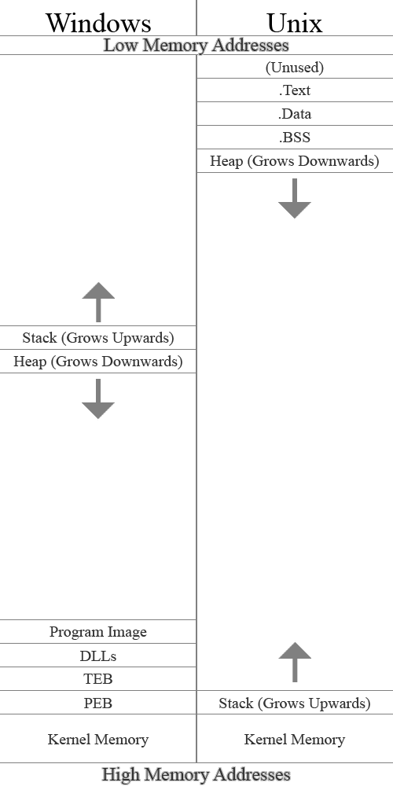

# Memory Allocation
Have you ever thought about *how you think*? It might be fair to say that computers have no choice, and that includes
how they "remember things". In this post I'll be talking about how memory allocators work.

A memory allocator simply put is the portion of code that almost every program uses to *dynamically* create sections of
memory for information to live. But before we get into that, I think it's important to talk about the other major place
memory lives during the lifetime of your program, *the stack*.

Aside: although these concepts are almost universally applicable, I will be discussing the remainder of this post from
a C-esq perspective.

## The stack

When your program begins running instructions one-by-one, starting from `main()`, eventually your program will
encounter a function, which is (for the intents and purposes of this discussion):

- a group of instructions
- that perform a conceptual task
- that you've given a name
- and something you may wish to do multiple times during your program

Whenever you call this function, your program begins executing that segment of your code. Notably though, when this
function is through it resumes from the location where it was called from, and all "contextual information" from the
caller is as you left it. Although this seems natural, our computers make sure that everything stays in order very
intentionally, and goes out of its way to do it.

Consider a `main()` function that has a couple of variables at the beginning, followed by a function call:

```c
void main() {
    int x = 5, y = 10;
    //some stuff...
    foo();
    //more stuff...
}
```

Now, imagine that it's *you* doing this work, [not a computer]. First you have two variables `x` and `y`. As a busy
human with a fried short-term memory, not only is it important you keep track of where you decide to record the
variable values, but it's important you record the information necessary to disambiguate `x` from `y`, and whatever
other variables you might have. In a computer, the names themselves aren't very important, but you do need to remember
that any particular variable (e.g., `x`) corresponds to a specific memory address. You can call it whatever you want,
but since a memory address is simply a number, we might just refer to `x` by the address where it sits in memory. This
distinction is important, as we'll see later.

Now realize that once you call `foo()`, you now have a whole extra sequence of instructions to complete. `foo()` may
even contain other function calls, which contain more variables and more function calls. It's a mess! Organization is
the key, and the way a computer approaches this issue is could be similar to how you might keep track of it.

Let's say at the beginning of `main()`, you took out your dry-erase marker and got busy. At the bottom of your
whiteboard you labeled "main" (denoting that everything above "main" pertains to the stack frame of main[^1], unless
superceeded by another label). Then, above "main" you wrote the labels `x` and `y` (bottom to top[^2]) in black marker.
Then, upon the first assignment to `x` and `y`, you write their values to the right of `x` and `y` in blue marker[^3].
As you perform `//some stuff...`, possibly utilizing and/or manipulating the values in these variables, it's now time
to execute `foo()`. Since you've recorded the variables and their values on the whiteboard, we fortunately don't have
to rely on your poor short-term memory[^4].

At this point, your whiteboard looks something like this:
```
y 10
x 5
main
```

As we begin executing `foo()` we write the label "foo" to denote the beginning of a new stack frame. From this point
on, we can ignore the portion of the stack corresponding to "main", and we can just focus on "foo". If `foo()` ends up
calling another function(s), we can simply repeat this process. This may lead to a rather tall column of text on your
whiteboard, but we don't need to worry. Every time we finish working on a function, we need to return to the place that
this function was called from to continue working on the program (in this case, we would return to `main()`). Notably,
the purpose of `foo()` was to fulfill a task, and now that we're done, any text on the whiteboard corresponding to this
call to `foo()` (i.e., its stack frame) can be erased, since we're done with it.

Note that any creation of data (compiler optimizations aside[^5]) results of stuff getting put on the stack. Here's an
expanded example of `main()` above, each significant line of code has an accompanying comment that shows the state of
the stack at that point, as well as a number denoting the order of execution.

```c
void foo() {
    /*
    execution step #3

    foo
    y 10
    x 5
    main
    */
    int z = 20;
    /*
    execution step #4

    z 20
    foo
    y 10
    x 5
    main
    */
    //some stuff...
}

void main() {
    /*
    execution step #1

    main
    */
    int x = 5, y = 10;
    /*
    execution step #2
    y 10
    x 5
    main
    */

    //some stuff...
    foo();
    /*
    execution step #5
    
    y 10
    x 5
    main
    */
    //more stuff...
}
```

Critically, not only can functions "perform tasks", but they can "perform tasks, and report back some information".
After all, if it were you performing this work, it would be resonable if executing a function
sucessfully/unsuccessfully/[something else] might affect what you choose to do next. Computers do have a simple
mechanism for returning small values[^6], and even large values could be returned on the stack. I.e., as the executor
of a function, you could simply decide that upon finishing a function, instead of erasing *everything* on the
whiteboard pertaining to the stack frame of that function, you could keep the information regarding the "result" of
that function, and "adopt"[^7] it into the stack of the calling function. Although it may be natural to allocate space on
the whiteboard for variables in the order they appear in the function source code, the only important part is that the
code that interacts with these variables "remembers where they live" i.e., it doesn't really matter where on the stack,
so long as it's in the stack frame. With this in mind, we can be sure to allocate the memory where the return value
lives at the very beginning of the function call, so that the caller of the function can easily "adopt" the return
value into it's stack frame without also including all the other junk in the former stack frame.

Consider this simple example:

```c
int foo() {
    int z = 5;
    return z;
}

void main() {
    int x = 5, y = 10;
    int foo_result = foo();
}
```

At the very end of main, the stack frame may look something like this:
```
foo_result 5
foo (ignored)
y 10
x 5
main
```

Notably, the value `z` from foo would have sat above the foo label, and then upon arriving back at `main()`, the value
`z` that got adopted into `main()`'s stack frame was given a new name `foo_result`. However, the label `foo` for the
former stack frame for the call to `foo()` is still on the stack, but we can just ignore it. As amazing and efficient
as this process seems to be, it isn't perfect. Consider this example:

```c
int bar() {
    int z = 5;
    return z;
}

int foo() {
    int bar_result = bar();
    //some other large stack frame data...
    return bar_result;
}

void main() {
    int x = 5, y = 10;
    int foo_result = foo();
}
```

Walking through a similar thought process, at the very end of main, the stack frame may look something like this:
```
foo_result 5 //formerly bar_result, formerly z
bar (ignored)
//some other large stack frame data...
foo (ignored)
y 10
x 5
main
```

Assuming the same procedure of "adopting" `z` into `foo()`'s stack frame when calling `bar()`, and again with adopting
`bar_result` into `main()` as `foo_result`. Since `foo()` had `//some other large stack frame data...`, this leads to a
messy and bloated stack frame for `main()`. Although in this example it's ok, what if `main()` had more stuff at the
end (e.g., another function call). Since `foo_result` is adopted into `main()`'s stack frame, our stack grows from the
location of `foo_result`, not `y`. It isn't hard to imagine that complex programs could coincedentally "game the system"
to cause the majority of stack space to consist of useless bloat, which isn't ideal. We want our memory to be
efficiently used, not wasted! These considerations get *especially* messy when you realize that the context in which
other functions might be called could be *different*. E.g., what if `main()` calls `foo()`? Well, we need to handle
the stack in a certain way. What if `main()` calls `bar()` directly, or what if `bar()` calls `foo()`, which calls
`bar()` recursively? Although it *is* possible to keep track of when/how things need to be moved around to prevent
data from getting squashed, **this sucks**.

What if instead of "adopting" the variable into `main()`'s stack frame, we just let it exist out there in no-mans land.
This means we can let the stack grow from `y`, and all we need to do is make sure that if the stack grows large enough
to overlap `foo_result`, we need to relocate `foo_result` somehow. We could make sure to grow from 
`y + sizeof(foo_result)`, and simply relocate `foo_result` to that saved location if we ever grow large enough. Maybe
we could relocate it *really really far forward* in the stack. If we do this though, we would need to make sure that
any other situations where we similarly relocated adopted variables "*really really far forward*" in the stack don't
accidentally end up in the same spot. However, a copy is a copy, and copying it really far forward might not be enough.
We may have to copy it forward several times, so maybe we should just copy it adjacent to `y` to begin with to avoid
the possibility of needing to copy it multiple times.

Although a nonstandard compiler extension[^8], what if the size of a variable on the stack isn't known at compile time?
e.g., what if the "size of the variable" is dependent upon user input? Consider something *like* this:
```c
void main(int argc, char* argv[]) {
    //safety concerns aside...
    int size = atoi(argv[1]);
    char buffer[size];
}
```

Well, if/when we have a subsequent function call, deciding where to put the label for that function call to begin a new
stack frame requires *checking* and *adding together* the lengths of these variably sized stack variables[^9]. Also,
it sucks that we have to even keep track of the size of these variables for these calculations on the stack, because
that data might not be something the programmer cares about. If these arrays were known in compile time, we could just
make sure that all the assembly that gets generated does so in a way that's certain about the size of this variable,
thus relieving us of this extra work (which is the default behavior). If you wonder why classic C code often has
compile-time buffer sizes, this is one reason why.

This is starting to feel nasty, but it's the brand of nasty that compiler developers deal with, and it might be fair to
say that a limited amount of nasty is fair in *practice*. If you squint your eyes, what I've described is essentially
just a stack machine[^10]. Unfortunately, we live in a real, physical, world (yuck). We need to obey the laws of
physics[^11], and these are implementation details after all. We've designed our computers with the goal of *doing
work*, and we try to limit the amount of *work we need to do to be able to do our work* to a minimum. Given that we're
talking about memory, things like computer cache/TLB/registers/virtual memory all come to mind and are consequential
in this situation, although some of this was ""arbitrarily"" designed, e.g., cache was invented because SRAM is
expensive and not dense compared to DRAM (but we wanted capacity). Virtual memory was invented so the OS could handle
process relocation (rather than it being done statically in the program, or the program needing to patch itself). TLB
was invented due to the inventions of both cache and virtual memory.

There's a lot of things our computers *could do* to be faster, whether it be nasty dynamic stack shenanagains, or
unpatching various side-channel attacks against our predictive computation systems, but there are reasons not to[^12].

So what other ideas do we have to solve this problem of *dynamic memory allocation*?

## Dynamic memory allocation

Golly, **what a headache**. It seems to me that separating the portion of memory that seems to be good for keeping
track of control (execution) from the *data* data is a good idea. Lets take a look at how memory is laid out for a
typical process.



There's a few notable things about the layouts of unix/windows processes:

- In windows, the stack grows towards low memory addresses. Note that this means that the (virtual) memory address 0 is
the absolute limit for the stack size.
- In unix, the stack grows towards the heap. This means the "absolulte largest size the stack can be" is a bit less
obvious. It depends on the size of the heap.
- In both, similar implicit limits exist for the "Heap".
- In windows, "Program Image" roughly equates to ".Text" + ".Data" + ".BSS" in unix.
- "Kernel Memory" in both refers to the memory that the operating system occupies. The kernel memory is in a processes
virtual memory map for syscalls[^13].

And guess what? There *is* (essentially) a "second stack" that we can use for our *data* data, it's the heap!

To interact with the heap, on unix there's `s/brk()`, which increases/decreases the size of the heap. `s/brk()` usage
is often discouraged because it isn't thread safe, and because the "default" C memory allocator `malloc()` uses
`s/brk()`, so any additional usage of it will mess up `malloc()`[^14]. If we intend to use `s/brk()` for our memory
allocator, we either need to not include the standard C library (which may be an issue if any libraries we use require
the library), or we need to make sure our dynamic memory allocator has the *exact* same API as the standard
implementation, and link against our implementation instead.

On windows, `HeapAlloc()`, `LocalAlloc()` and `GlobalAlloc()`[^15] all interact with the heap, but do so in different
ways. `malloc()` usually wraps `HeapAlloc()` on windows, and although the problems with `s/brk()` above don't apply due to the presense of actual management with these three functions, I would rather that a cross platform implementation of *my*
memory allocator use logically similar sources of memory. Although these functions internally manipulate the heap
directly, there isn't an API method to "`s/brk()`" on windows directly.

`malloc()` is smart in that it makes large increments in `s/brk()` on unix & simply wraps `HeapAlloc()` on windows,
this prevents heap thrashing[^16] and reduces the number of necessary syscalls. `malloc()` is implementation defined
though, so you can't always rely on it working this way. Fortunately, the implementers are smart and attempt to back
`malloc()` with the best solution for the platform.

POSIX[^17] specifies `mmap()`, which allocates more memory pages that exist outside of the Process Memory layout
diagram above[^18], fetched straight from the kernel's free pages. `mmap()` has some additional features, namely the
ability to share the memory mapped in this fashion with other processes, allowing these processes the ability to
communicate with each other as they run.

On windows, `VirtualAlloc()` is very similar to `mmap()` in that it fetches more pages from the kernel. It can even
lazily allocate memory[^19], and share it with other processes. Both of these features have additional features, and
I encourage you to do your own reading about these systems.

### Implementation

With either of these functions, for every dynamic value you wish to store, nothing's really stopping you from using the
page(s) for your single variable, but since mnay values are far less than 4KiB or (page size), this would be very
wasteful. With this in mind, we know that we'll need to have some internal management mechanism.

My goal was to make a memory allocator that was compatible on both windows and linux and wouldn't interfere with
`malloc()`, so first I wrote cross-platform methods to allocate and free page(s).

```c
void* p_alloc(size_t pageCount)
{
	void* result;
	size_t byteCount = pageCount * p_size();
#if _WIN32
	result = VirtualAlloc(NULL, byteCount, MEM_COMMIT, PAGE_READWRITE);
	if (result == NULL)
	{
		fprintf(stderr, "Windows Virtual Alloc Failed: %d", GetLastError());
		exit(-1);
	}
#else
	result = mmap(0, byteCount, PROT_READ | PROT_WRITE, MAP_PRIVATE | MAP_ANON, -1, 0);
	if (result == MAP_FAILED)
	{
		fprintf(stderr, "POSIX mmap failed: %d", errno);
		exit(-1);
	}
#endif
	return result;
}
```

This page allocation function allocates for you `pageCount` pages in a platform agnostic way. We make sure to set
appropriate settings (e.g., we do not want to enable the ability for this memory to be executable). I leave `p_free()`
as an excersize to the reader.

You'll notice that we allocate memory in terms of `pageCount`, which isn't that useful alone. Since we're ultimately
working with requests in terms of `bytes`, we need a way to know how large a page is on the given platform. Here's how
I did that.

```c
size_t p_size()
{
	static size_t ps = 0;
#if _WIN32
	if (ps == 0)
	{
		SYSTEM_INFO si;
		GetSystemInfo(&si);
		ps = si.dwPageSize;
	}
#else
	if (ps == 0)
		ps = getpagesize();
#endif
	return ps;
}
```

Since batching calls (e.g., the way `malloc()` does it) can reduce syscalls, we want to ensure that the several places
throughout our code where we have to check the size of the pages (so we can calculate the number of bytes we have), is
fast, and doesn't have too many system calls. Even with the fanciest of operating systems (to my knowledge), changing
the size of pages on your system would require a system reboot. Thus, we only need to check the page size once (via a
syscall), and we cache it in a static local and return that cached value for all subsequent calls.

Getting on to the algorithm itself,

## Conclusion

You can find a full implementation of my heap at https://github.com/TheUbMunster/stg-heap. If this is something you
choose to undertake, there are several tutorials on the internet about it that talk about the decision making processes
and many examples to learn from. Make sure to put your own spin on it. Try out an optimization, or a different
management scheme, perhaps you'll discover something new! A peer of mine not too long ago discovered a management
scheme that decreases the cost of overall allocations, and people out there are already implementing this scheme[^69]!

Good luck!

## Footnotes

[^1]: A stack frame is the portion of the stack that stores data pertaining to an instance of a function call. Even if
e.g. `bar()` is called, and then `bar()` calls itself again, the two instances of the `bar()` calls each have their own
stack frames. After all, if the parentmost call to `bar()` has a variable `x` with a value of `12`, and the nested call
to `bar()` has the variable `x` with a value of `37`, this *is* valid and fair, and we need to make sure they each have
their own portion of the stack (i.e., a *stack frame*) to keep their local data separate from each other.

[^2]: When computer scientists discuss the stack, it's popular to represent the stack as "growing downwards" instead of
upwards. This is a natural reflection of the fact that in many ABI/computer architecture designs, the larger the stack,
the "lower" the head of the stack sits in memory. When drawing diagrams that show the layout of a process, this makes
it more natural to depict it "growing downwards". This is just a preference though, and I prefer to do it in the other
direction in this case (i.e., growing "up" the whiteboard).

[^3]: The distinction in marker color is simply to indicate that the *name* and *value* of a variable are two distinct
concepts.

[^4]: "don't have to rely on your poor short-term memory" is an analogy for how the equivalent computer mechanism,
[registers](https://en.wikipedia.org/wiki/Processor_register), are primarily for performing small intermediate tasks,
and there are a finite amount of them, each with a finite size.

[^5]: In many scenarios, the compiler can observe the structure of your code and realize that (e.g., variables
representing an intermediate calculation) don't really *need* to be on the stack, and instead can simply exist in
registers during their calculation and usage. Conversely, if you have an extremely complex (e.g., math expression) that
takes up a lot of intermediate calculation space, it's possible that the computer *doesn't have enough registers* to
hold the intermediate calculations, so the compiler may actually *generate new variables on the stack that didn't exist
in your source code* to hold the "overflow".

[^6]: On many computer architectures, there are dedicated register(s) for storing a return value. The idea is that
after calling a function that returns a value, the caller simply checks that register *for the returned value*.

[^7]: The "adopting" concept doesn't seem great, because the natural behavior of the stack makes it so that the
lifetime of an object is the same as the lifetime of the function that created that object, and sometimes we want
it to last longer. Although "adopting" it accomplishes this, it isn't a naturally arising behavior.

[^8]: Up to the compiler implementation, `alloca(size_t size)` will dynamically allocate an amount of bytes on the
stack. This is useful if you don't want to deal with the computational overhead of a heap. In addition to this, there's
a feature called [VLA](https://en.wikipedia.org/wiki/Variable-length_array) that accomplishes something similar
with implicit syntax.

[^9]: This is usually implicitly done, i.e., the register that holds the address of "the top of the stack" is usually
pre-emptively updated whenever a local variable is created on the stack. The critical difference, is that we'd be
increasing the size of the stack by a dynamic value rather than a compile time constant.

[^10]: [Stack machines](https://en.wikipedia.org/wiki/Stack_machine) are theoretical "computers" that were invented on
paper a long time ago. The point of stack machines were to *prove things* about stack machines, that you could then
use to prove things about *how powerful* programs are, classes of computation (P vs NP etc.) and a bunch of other
stuff.

[^11]: Citation needed.

[^12]: The first thing that comes to mind is how we like the programs on our computers to adhere to a set of rules,
for the sake of inter-process intercompatibility (e.g., .dll/.so). Learn about the concept of
[ABI](https://en.wikipedia.org/wiki/Application_binary_interface) if you're curious about this. Additionally, ever
wonder why (x86) linux programs can't run on (x86) windows & vice versa? They're the same computer architecture,
they *do* use the same assembly/machine code after all. Well, the ABI's are different, but linux uses
[ELF](https://en.wikipedia.org/wiki/Executable_and_Linkable_Format) for executable files, and windows uses 
[PE](https://en.wikipedia.org/wiki/Portable_Executable). (Although windows indirectly supports executing ELF files via
WSL). Maybe you could write a native ELF executor for windows, or maybe a native PE executor for linux! Maybe look into
[fat binaries](https://en.wikipedia.org/wiki/Fat_binary)?

[^13]: I.e., wrappers for "secure methods" of interacting with the operating system that requires permission elevation.

[^14]: `malloc()` assumes it has full control of `s/brk()`, so any intermixed calls will lead to invalid program state.

[^15]: [Microsoft docs](https://learn.microsoft.com/en-us/windows/win32/memory/comparing-memory-allocation-methods).

[^16]: Thrashing refers to a scenario where the underlying implementation of a collection that gets repeatedly added
to and removed from causes repeated expensive operations relating to memory (re)allocation/deallocation (in this case,
repeated calls to `s/brk()` or internal heap manipulation caused by `HeapAlloc()`).

[^17]: POSIX is a collection of features/API that different operating systems can implement for ease of cross-platform
development and intercompatibility. Many versions of unix are fully/partially POSIX compliant, including linux and
MacOS.

[^18]: To keep the ledgerging simple, your operating system dispenses memory in entire *pages*. Pages are often 4KiB in
size, but there are several sizes that you can set.

[^19]: Lazy allocation/initialization/computation refers to the idea of beginning a task, not certain if you're going
to utilize the resource (but it is avaliable if you need it).

[^69]: [Link to paper](https://arxiv.org/abs/2204.10455).

# Talk about how the stack hasn't always existed?