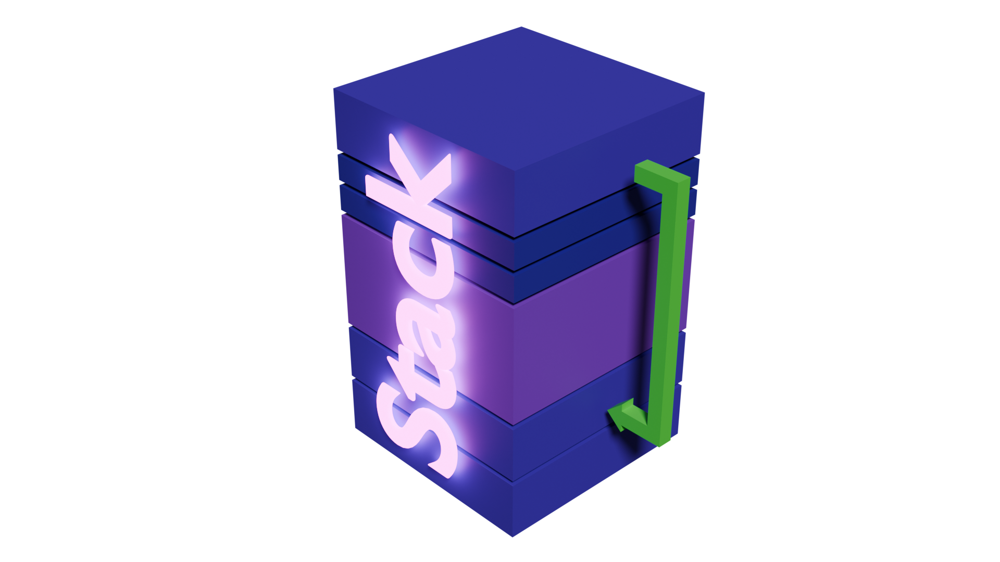

# Stacks


When achieving *exact* behavior in a computer, keeping track of [everything that can be kept track of] is essential.
The concept of a stack (the data structure) has been a part of designs for control flow for programs and computers
since the mid 50's[^1]. Keeping track of a program's control flow using a stack allowed for concepts like recursion,
intermediate state, and even application specific features to naturally appear, and is fundamental to the implementation
of most computers. In this post I'll be talking about how the stack works.

## The stack

When your program begins running instructions one-by-one, starting from `main()`, eventually your program will
encounter a function, which is (for the intents and purposes of this discussion):

- a group of instructions
- that perform a conceptual task
- that you've given a name
- and something you may wish to do multiple times during your program

Whenever you call this function, your program begins executing that segment of your code. Notably though, when this
function is through it resumes from the location where it was called from, and all "contextual information" from the
caller is as you left it. Although this seems natural, our computers make sure that everything stays in order very
intentionally, and goes out of its way to do it.

This is especially true of control flow, which is the concept regarding how your program flows from "task to task",
including "what conditions were met" to make any particular task occur.

Consider a `main()` function that has a couple of variables at the beginning, followed by a function call:

```c
void main() {
    int x = 5, y = 10;
    //some stuff...
    foo();
    //more stuff...
}
```

### Analogy

Now, imagine that it's *you* doing this work, [not a computer]. First you have two variables `x` and `y`. You're a busy
human with a fried short-term memory (too many python tutorials), and a desire to be *critically exact* with your
computations. Not only is it important you keep track of where you decide to record the variable values, but it's
important you record the information necessary to disambiguate `x` from `y`, and whatever other variables you might
have. In a computer, the names themselves aren't very important, but you do need to remember that any particular
variable (e.g., `x`) corresponds to a specific memory address. You can call it whatever you want, but since a memory
address is simply a number, we might just refer to `x` by the address where it sits in memory. This distinction is
important, as we'll see later.

Now realize that once you call `foo()`, you now have a whole extra sequence of instructions to complete. `foo()` may
even contain other function calls, which contain more variables and more function calls. It's a mess! Organization is
the key, and the way a computer approaches this issue is could be similar to how you might keep track of it. (Remember,
computers aren't useful if they aren't deterministic. You've created mechanisms in your office to prepare for
*critically exact* computation).

Let's say at the beginning of `main()`, you took out your dry-erase marker and got busy. At the bottom of your
whiteboard you labeled "main" (denoting that everything above "main" pertains to the stack frame of main[^2], unless
superceeded by another label). Then, above "main" you wrote the labels `x` and `y` (bottom to top[^3]) in black marker.
Then, upon the first assignment to `x` and `y`, you write their values to the right of `x` and `y` in blue marker[^4].
As you perform `//some stuff...`, possibly utilizing and/or manipulating the values in these variables, it's now time
to execute `foo()`. Since you've recorded the variables and their values on the whiteboard, we fortunately don't have
to rely on your poor short-term memory[^5] as we shift our focus to completing the task `foo()`.

At this point, your whiteboard looks something like this:
```text
y 10
x 5
main
```

As we begin executing `foo()` we write the label "foo" to denote the beginning of a new stack frame. From this point
on, we can ignore the portion of the stack corresponding to "main", and we can just focus on "foo". If `foo()` ends up
calling another function(s), we can simply repeat this process. This may lead to a rather tall column of text on your
whiteboard, but we don't need to worry. Every time we finish working on a function, we need to return to the place that
this function was called from to continue working on the program (in this case, we would return to `main()`). Notably,
the purpose of `foo()` was to fulfill a task, and now that we're done, any text on the whiteboard corresponding to this
call to `foo()` (i.e., its stack frame) can be erased, since we're done with it.

Note that any creation of data (compiler optimizations aside[^6]) results of stuff getting put on the stack. Here's an
expanded example of `main()` above, each significant line of code has an accompanying comment that shows the state of
the stack at that point, as well as a number denoting the order of execution.

```c
void foo() {
    /*
    execution step #3

    foo
    y 10
    x 5
    main
    */
    int z = 20;
    /*
    execution step #4

    z 20
    foo
    y 10
    x 5
    main
    */
    //some stuff...
}

void main() {
    /*
    execution step #1

    main
    */
    int x = 5, y = 10;
    /*
    execution step #2
    y 10
    x 5
    main
    */

    //some stuff...
    foo();
    /*
    execution step #5
    
    y 10
    x 5
    main
    */
    //more stuff...
}
```

## Data management

When managing the information that represents the program state (control), and the program *state* (data), there's lots
of small and large ideas that have been used over time.

### Data management approach \#1

Critically, not only can functions "perform tasks", but they can "perform tasks, and report back some information".
After all, if it were you performing this work, it would be resonable if executing a function
sucessfully/unsuccessfully/[something else] might affect what you choose to do next. Computers do have a simple
mechanism for returning small values[^7], and even large values could be returned on the stack. I.e., as the executor
of a function, you could simply decide that upon finishing a function, instead of erasing *everything* on the
whiteboard pertaining to the stack frame of that function, you could keep the information regarding the "result" of
that function, and "adopt"[^8] it into the stack of the calling function.

Although it may be natural to allocate space on the whiteboard for variables in the order they appear in the function
source code, the only important part is that the code that interacts with these variables "remembers where they live"
i.e., it doesn't really matter where on the stack, so long as it's in the stack frame. With this in mind, we can be sure
to allocate the memory where the return value lives at the very beginning of the function call, so that the caller of
the function can easily "adopt" the return value into it's stack frame without also including all the other junk in the
former stack frame.

Consider this simple example:

```c
int foo() {
    int z = 5;
    return z;
}

void main() {
    int x = 5, y = 10;
    int foo_result = foo();
}
```

At the very end of main, the stack frame may look something like this:
```text
foo_result 5
foo (ignored)
y 10
x 5
main
```

Notably, the value `z` from foo would have sat above the foo label, and then upon arriving back at `main()`, the value
`z` that got adopted into `main()`'s stack frame was given a new name `foo_result`. However, the label `foo` for the
former stack frame for the call to `foo()` is still on the stack, but we can just ignore it. As amazing and efficient
as this process seems to be, you can probably see a problem here. Consider this example:

```c
int bar() {
    int z = 5;
    return z;
}

int foo() {
    int bar_result = bar();
    //some other large stack frame data...
    return bar_result;
}

void main() {
    int x = 5, y = 10;
    int foo_result = foo();
}
```

Walking through a similar thought process, at the very end of main, the stack frame may look something like this:
```text
foo_result 5 //formerly bar_result, formerly z
bar (ignored)
//some other large stack frame data...
foo (ignored)
y 10
x 5
main
```

Assuming the same procedure of "adopting" `z` into `foo()`'s stack frame when calling `bar()`, and again with adopting
`bar_result` into `main()` as `foo_result`. Since `foo()` had `//some other large stack frame data...`, this leads to a
messy and bloated stack frame for `main()`. Although in this example it's ok, what if `main()` had more stuff at the
end (e.g., another function call). Since `foo_result` is adopted into `main()`'s stack frame, our stack grows from the
location of `foo_result`, not `y`. It isn't hard to imagine that complex programs could coincedentally "game the system"
to cause the majority of stack space to consist of useless bloat, which isn't ideal. We want our memory to be
efficiently used, not wasted! These considerations get *especially* messy when you realize that the context in which
other functions might be called could be *different*. E.g., what if `main()` calls `foo()`? Well, we need to handle
the stack in a certain way. What if `main()` calls `bar()` directly, or what if `bar()` calls `foo()`, which calls
`bar()` recursively? Although it *is* possible to keep track of when/how things need to be moved around to prevent
data from getting squashed, **this sucks**.

### Data management approach \#2

What if instead of "adopting" the variable into `main()`'s stack frame, we just let it exist out there in no-mans land.
This means we can let the stack grow from `y`, and all we need to do is make sure that if the stack grows large enough
to overlap `foo_result`, we need to relocate `foo_result` somehow. We could make sure to grow from 
`y + sizeof(foo_result)`, and simply relocate `foo_result` to that saved location if we ever grow large enough. Maybe
we could relocate it *really really far forward* in the stack. If we do this though, we would need to make sure that
any other situations where we similarly relocated adopted variables "*really really far forward*" in the stack don't
accidentally end up in the same spot. However, a copy is a copy, and copying it really far forward might not be enough.
We may have to copy it forward several times, so maybe we should just copy it adjacent to `y` to begin with to avoid
the possibility of needing to copy it multiple times.

I don't think we need to explore this option much further, it doesn't seem to work well. Approaches like #1 and #2
are more common when the compiler makes optimizations for "leaf methods", but are usually unsafe unless a system was
designed from the ground up with them in mind.

### Data management approach \#3

Although a nonstandard compiler extension[^9], what if the size of a variable on the stack isn't known at compile time?
e.g., what if the "size of the variable" is dependent upon user input? Consider something *like* this:
```c
void main(int argc, char* argv[]) {
    //safety concerns aside...
    int size = atoi(argv[1]);
    //this normally wouldn't compile since its size is not a ctc
    char buffer[size];
}
```

Well, if/when we have a subsequent function call, deciding where to put the label for that function call to begin a new
stack frame requires *checking* and *adding together* the lengths of these variably sized stack variables[^10]. Also,
it sucks that we have to even keep track of the size of these variables for these calculations on the stack, because
that data might not be something the programmer cares about. If these arrays were known in compile time, we could just
make sure that all the assembly that gets generated does so in a way that's certain about the size of this variable,
thus relieving us of this extra work (which is the default behavior). If you wonder why classic C code often has
compile-time buffer sizes, this is one reason why.

### Data management approach \#4

One of the smarter methods to deal with the above problem(s) when it comes to data management within the stack, is to
pre-allocate the space needed for variables ASAP. The second control flow deterministically leads to any particular
outcome that results in the need for [room to be made for some data], instead of waiting, we can just make that room
*now*. One example of this is how some functions have a return type. It's size is known at compile-time, and once
control flow deterministically leads to that function call, we can make room on the stack for the return value *before
we even call the function*. When the function does return, we can ensure that the function places the result into memory
negatively relative to the base of the current stack frame, and then return. We can also ensure that any function call
for this function has a similar treatment to "pre-setup" before the function call.

## So what?

This is starting to feel nasty, but it's the brand of nasty that compiler developers deal with, and it might be fair to
say that a limited amount of nasty is fair in *practice*. If you squint your eyes, some of what I've described is
remeniscent of a stack machine[^11]. Unfortunately, we live in a real, physical, world (yuck). We need to obey the laws
of physics[^12], and these are implementation details after all. We've designed our computers with the goal of *doing
work*, and we try to limit the amount of *work we need to do to be able to do our work* to a minimum.

Given that we're talking about memory, a lot of the strange decisions that get made in some implementations were
consequences of how some things were designed. Computer cache/TLB/registers/virtual memory all come to mind and are
consequential in this situation, although some of this was ""arbitrarily"" designed:
- cache was invented because SRAM is expensive and compared to DRAM, so instead of using SRAM for system memory, we
use it for cache and use DRAM for the main system memory. 
- Virtual memory was invented so the OS could handle process relocation (rather than it being done statically in the program, or the program needing to patch itself).
- TLB was invented to accelerate virtual memory usage, and was inspired by the invention of cache.

There's a lot of things our computers *could do* to be faster, whether it be nasty dynamic stack shenanagains, or
unpatching various side-channel attacks against our predictive computation systems, but there are reasons not to[^13].
Although it's unfortunate that the stack isn't perfect for everything we'd like to do with it, you should be
grateful[^14]!

At this point, it seems like this is just a list of "potentially useful musings". Accurate! As we computer scientists
have gotten a handle on what good memory management looks like, we've evolved through several ideas. Sometimes we have
"bad design ideas" that turn out to be "fast" in practice. I've witnessed code in certain PS1 games that perform
certified [naughty things] in regards to the platform's ABI, but this was done for the sake of speed. Whether or not
this was done for better cache performance, or better/fewer instructions to complete a task, typically depended on 
"what type of task" that code was performing.

*To my knowledge, every concept I've discussed in this article was a [not necessarily common] practice on computers
and/or computer systems throughout time*. Some of these ideas seem to have matured into [certified bad ideas] at this
point, but don't knock it yet! These "bad practices" may only be bad due to our arbitrary-ish decision making when it
comes to our (e.g) ABI designs, hardware architecture designs, or paradigms that evolved over time. Some of these ideas
may not have been so bad at the time. A lot of dead weight from the past has yet to leave us.

## Conclusion

The design of how "computers manage control state" has changed a lot over time. Although moreso when computer science
as a field was just getting started, and much less when the advent of popular architectures like x86 rolled around,
there are still plenty of examples where "tricks", "hardware features", and new designs result in "atypical" control
flow management.

Nowadays, we've gotten really good at understanding that there's a trade off for design and speed. Given a program you
wrote and compiled to a target device, if I could snap my fingers and give to you a computationally equivalent build,
but is also *the most efficient general-use* version of that program in terms of best CPU utilization, its machine code
almost certainly has no discernable structure or patterns. For all you know, it achieves some of its speed by utilizing
bugs in the hardware, ABI, OS, runtime, or some other part of the system. Although its touted speed is great, this
doesn't seem worth it, even if it was achievable in the real world.

There's a lot you could do. I recommend taking some small programs, and looking at their assembly with a disassembler.
You'll probably notice several patterns at the beginnings/ends of most functions. These patterns probably aren't the
same for all functions. How interesting!

### Contact
If I've said something incorrect, or have anything else to say to me, contact me @ 
[tangleboom@gmail.com](mailto:tangleboom@gmail.com), I would love to update this post with the most accurate
information!

<!--## Footnotes-->

[^1]: Not only has the stack been around since the 50's (invented by Friedrich Bauer), he's also responsible for the
    entire concept of a "stack machine", as well as many other ideas that have stuck around up to today.

[^2]: A stack frame is the portion of the stack that stores data pertaining to an instance of a function call. Even if
    e.g. `bar()` is called, and then `bar()` calls itself again, the two instances of the `bar()` calls each have their own
    stack frames. After all, if the parentmost call to `bar()` has a variable `x` with a value of `12`, and the nested call
    to `bar()` has the variable `x` with a value of `37`, this *is* valid and fair, and we need to make sure they each have
    their own portion of the stack (i.e., a *stack frame*) to keep their local data separate from each other.

[^3]: When computer scientists discuss the stack, it's popular to represent the stack as "growing downwards" instead of
    upwards. This is a natural reflection of the fact that in many ABI/computer architecture designs, the larger the stack,
    the "lower" the head of the stack sits in memory. When drawing diagrams that show the layout of a process, this makes
    it more natural to depict it "growing downwards". This is just a preference though, and I prefer to do it in the other
    direction in this case (i.e., growing "up" the whiteboard).

[^4]: The distinction in marker color is simply to indicate that the *name* and *value* of a variable are two distinct
    concepts.

[^5]: "don't have to rely on your poor short-term memory" is an analogy for how the equivalent computer mechanism,
    [registers](https://en.wikipedia.org/wiki/Processor_register), are primarily for performing small intermediate tasks,
    and there are a finite amount of them, each with a finite size.

[^6]: In many scenarios, the compiler can observe the structure of your code and realize that (e.g., variables
    representing an intermediate calculation) don't really *need* to be on the stack, and instead can simply exist in
    registers during their calculation and usage. Conversely, if you have an extremely complex (e.g., math expression) that
    takes up a lot of intermediate calculation space, it's possible that the computer *doesn't have enough registers* to
    hold the intermediate calculations, so the compiler may actually *generate new variables on the stack that didn't exist
    in your source code* to hold the "overflow".

[^7]: On many computer architectures, there are dedicated register(s) for storing a return value. The idea is that
    after calling a function that returns a value, the caller simply checks that register *for the returned value*.

[^8]: The "adopting" concept doesn't seem great, because the natural behavior of the stack makes it so that the
    lifetime of an object is the same as the lifetime of the function that created that object, and sometimes we want
    it to last longer. Although "adopting" it accomplishes this, it isn't a naturally arising behavior.

[^9]: Up to the compiler implementation, `alloca(size_t size)` will dynamically allocate an amount of bytes on the
    stack. This is useful if you don't want to deal with the computational overhead of a heap. In addition to this, there's
    a feature called [VLA](https://en.wikipedia.org/wiki/Variable-length_array) that accomplishes something similar
    with implicit syntax.

[^10]: This is usually implicitly done, i.e., the register that holds the address of "the top of the stack" is usually
    pre-emptively updated whenever a local variable is created on the stack. The critical difference, is that we'd be
    increasing the size of the stack by a dynamic value rather than a compile time constant.

[^11]: [Stack machines](https://en.wikipedia.org/wiki/Stack_machine) are theoretical "computers" that were invented on
    paper a long time ago. The point of stack machines were to *prove things* about stack machines, that you could then
    use to prove things about *how powerful* programs are, classes of computation (P vs NP etc.) and a bunch of other
    stuff.

[^12]: Citation needed.

[^13]: The first thing that comes to mind is how we like the programs on our computers to adhere to a set of rules,
    for the sake of inter-process intercompatibility (e.g., .dll/.so). Learn about the concept of
    [ABI](https://en.wikipedia.org/wiki/Application_binary_interface) if you're curious about this. Additionally, ever
    wonder why (x86) linux programs can't run on (x86) windows & vice versa? They're the same computer architecture,
    they *do* use the same assembly/machine code after all. Well, the ABI's are different, but linux uses
    [ELF](https://en.wikipedia.org/wiki/Executable_and_Linkable_Format) for executable files, and windows uses 
    [PE](https://en.wikipedia.org/wiki/Portable_Executable). (Although windows indirectly supports executing ELF files via
    WSL). Maybe you could write a native ELF executor for windows, or maybe a native PE executor for linux! Maybe look into
    [fat binaries](https://en.wikipedia.org/wiki/Fat_binary)?

[^14]: We weren't so lucky to have the ability to store locals like this. Some older computers simply had a stack of
    function labels *only*. You *could* keep track of the order functions were called, and where you needed to return to
    once the current function was over, but when it came to storing memory, you had to figure that out yourself. This was
    sometimes done as (e.g., Algol-58) by having the stack (which was really a linked-list), having a dedicated buffer for
    all local variables. I've also read that this was done by just having some spot in global memory that you stored all
    your stuff (some old IBM mainframe did this IIRC). You needed to make sure that all buffers/lists were large enough for
    any potential computation you could make, because you couldn't really resize them. Nothing was stopping you from
    writing a custom dynamic (memory allocator) solution though, and it didn't take very long for this to happen.